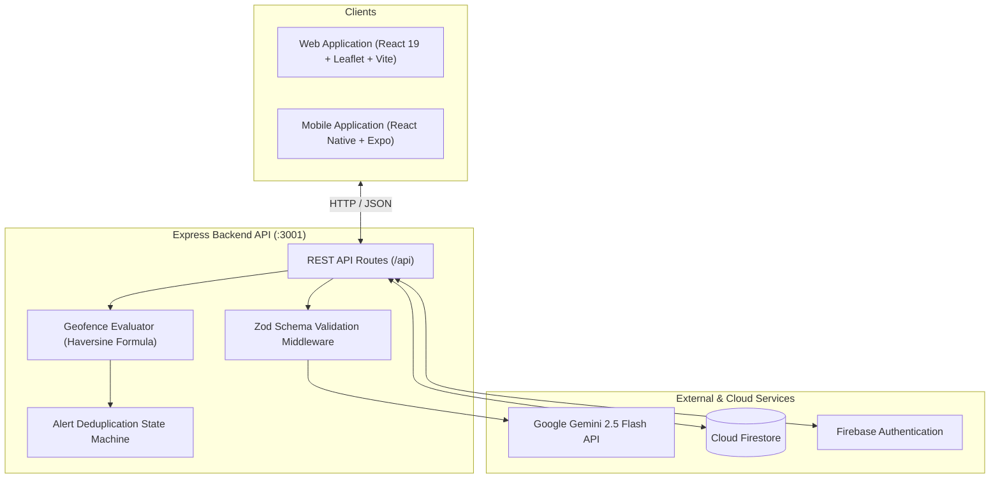

# AfterMe

Proactive AI memory assistant that pairs multimodal memory logging with context-grounded conversational retrieval and GPS geofence departure alerts.

[](https://github.com/rajdeep-r24/AfterMe/actions/workflows/test.yml)
[](https://nodejs.org)
[](https://www.typescriptlang.org)
[](https://ai.google.dev)
[](https://firebase.google.com)

---

## Overview

AfterMe helps users keep track of physical belongings, tasks, and locations. Instead of requiring manual search through static notes, the system:
1. **Extracts structured entities** from free-form text or photos (object, location, risk level, deadlines) using Gemini 2.5 Flash and validates the payload with Zod schemas.
2. **Answers queries with grounded citations**, matching user questions against stored memories and explicitly rejecting unknown items.
3. **Monitors spatial boundaries**, computing distance between the user's current GPS position and logged memory coordinates via the Haversine formula ($R = 6,371\text{ km}$) and triggering departure warnings when moving beyond a 60-meter radius.

---

## System Architecture



---

## Technical Mechanisms

### 1. Structured Entity Extraction & Validation
Incoming prompts sent to `POST /api/memories` are parsed by Gemini 2.5 Flash. The output is sanitized (removing markdown code fences) and validated using Zod against `MemoryExtractionSchema`:
```typescript
z.object({
  memory_type: z.enum(['belonging', 'task', 'document', 'event']),
  object: z.string(),
  location: z.string(),
  importance: z.enum(['low', 'medium', 'high']),
  risk_level: z.enum(['low', 'medium', 'high', 'critical']),
  deadline: z.string().optional(),
  action_required: z.boolean(),
  summary: z.string()
});
```
If the Gemini API key is not configured or network connectivity fails, a deterministic regex-based fallback extractor processes common patterns without throwing an unhandled exception.

### 2. Context-Grounded Retrieval
When querying `POST /api/ask`, user memories from Firestore are provided as context to Gemini 2.5 Flash. The model is constrained to cite only memory IDs present in the prompt. The backend cross-checks returned IDs against authentic database records—if no citation matches or the item was never logged, the API returns `has_match: false` with an explicit notice instead of guessing.

### 3. Geofence Distance Calculation & Deduplication
Spatial departure checks use the standard Haversine formula to compute great-circle distance over WGS-84 coordinates:

$$\Delta\sigma = 2 \arcsin\sqrt{\sin^2\left(\frac{\Delta\phi}{2}\right) + \cos\phi_1\cos\phi_2\sin^2\left(\frac{\Delta\lambda}{2}\right)}$$

$$d = R \cdot \Delta\sigma \quad (R = 6,371,000\text{ m})$$

An in-memory state tracker (`activeDepartures`) records transition states (`inside` $\rightarrow$ `outside`). A departure alert fires once upon crossing the 60m threshold. Subsequent GPS ticks outside suppress duplicates, and the detector re-arms only after the user returns inside the geofence radius.

---

## Quickstart

### Prerequisites
- Node.js 20+
- npm 10+

### 1. Installation
```bash
git clone https://github.com/rajdeep-r24/AfterMe.git
cd AfterMe
npm install
npm --prefix backend install
npm --prefix apps/web install
```

### 2. Environment Setup
Copy the example environment files:
```bash
cp .env.example .env
cp backend/.env.example backend/.env
```
*Note: A `GEMINI_API_KEY` is optional for local development. If omitted, the deterministic fallback engine executes automatically.*

### 3. Start Development Servers
```bash
npm run dev
```
- **Web App**: [http://localhost:5173](http://localhost:5173)
- **Backend API**: [http://localhost:3001](http://localhost:3001)

To run the mobile app:
```bash
npm run mobile
```

---

## Testing & Verification

All test suites run locally and in GitHub Actions CI (`.github/workflows/test.yml`):

```bash
# Run all test suites
npm test

# Run reproducible quantitative benchmark (N=26 samples)
npm run test:benchmark

# Individual test suites
npm run test:ai          # Zod validation and JSON sanitization
npm run test:gps         # Haversine distance and coordinate range validation
npm run test:alerts      # State machine deduplication and re-entry
npm run test:security    # Multi-tenant data isolation and 403 authorization
npm run test:resilience  # Failure modes and offline heuristic fallback
npm run test:metrics     # Telemetry counters and latency tracking
npm run test:e2e         # End-to-end integration workflow
```

### Benchmark Results ($N = 26$ Ground-Truth Samples)

The benchmark evaluates the system against 26 predefined test cases across extraction, retrieval, and geofencing:

| Benchmark Dimension | Sample Size | Passed / Total | Result | Testing Mode |
| :--- | :---: | :---: | :---: | :--- |
| Memory Entity Extraction | $N = 10$ | 10 / 10 | Pass | Gemini 2.5 Flash / Fallback Engine |
| Grounded Retrieval (Known Items) | $N = 6$ | 6 / 6 | Pass | Verified DB Citations |
| Unknown Entity Rejection | $N = 4$ | 4 / 4 | Pass | Explicit Non-Match Response |
| Geofence Departure Precision | $N = 6$ | 6 / 6 | Pass | Haversine Geodesic Math ($R=6371$km) |

*Tested against the backend HTTP API at `http://localhost:3001`.*

---

## Known Limitations

- **Background Geofencing**: Departure detection currently relies on GPS coordinates pushed by the active client application (foreground polling or manual simulation). Operating system-level background location daemons with energy-efficient wakeups (e.g., iOS Significant-Change / Android Geofencing API) are not yet implemented for closed-app execution.
- **Indoor GPS Attenuation**: Consumer GPS accuracy degrades indoors (often $\pm 50\text{m}$ to $200\text{m}$). The backend discards GPS readings with accuracy $>150\text{m}$ to prevent false departure alarms. Room-level distinctions rely on user text/photo cues rather than micro-positioning.
- **Gemini API Token Consumption**: Each memory extraction consumes approximately 250 input tokens and 120 output tokens ($\approx \$0.000075$ USD per request on the Gemini 2.5 Flash pay-as-you-go tier).
- **Offline Fallback Scope**: When running offline, the deterministic heuristic extractor supports single-clause entity and risk recognition. Multi-hop conversational reasoning and complex query synthesis require an active connection to the Gemini API.

---

## Authors

- **Pranav Bade** ([@Pranav7758051011](https://github.com/Pranav7758051011)) — Systems Lead & Core Architecture
- **Rajdeep Rathod** ([@rajdeep-r24](https://github.com/rajdeep-r24)) — AI Architect & Spatial Intelligence
- **Vedant Soni** ([@Vedant-git-333](https://github.com/Vedant-git-333)) — Product Lead & UX/Mobile

---

## License

Copyright &copy; 2026 Pranav Bade, Rajdeep Rathod, Vedant Soni. All rights reserved.  
Source-available for evaluation under the terms in the [`LICENSE`](./LICENSE) file.