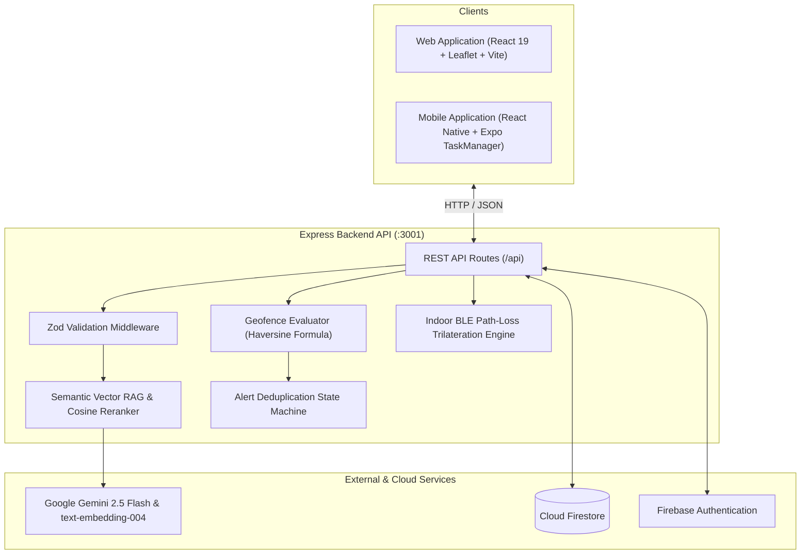

# AfterMe

Proactive AI memory assistant that pairs multimodal memory logging with context-grounded conversational retrieval, dense vector embeddings, and spatial geofence departure alerts.

[](https://github.com/rajdeep-r24/AfterMe/actions/workflows/test.yml)
[](https://nodejs.org)
[](https://www.typescriptlang.org)
[](https://ai.google.dev)
[](https://firebase.google.com)

---

## Overview

AfterMe helps users track physical belongings, tasks, and locations. Instead of requiring manual search through static notes, the system:
1. **Extracts structured entities** from natural text or photos using Gemini 2.5 Flash with runtime Zod schema validation.
2. **Performs dense vector retrieval (RAG)** using Gemini `text-embedding-004` (768-dim embeddings) and cosine similarity ranking with BM25 hybrid reranking.
3. **Answers queries with verified citations**, constraining responses to authentic database records and rejecting unknown queries.
4. **Evaluates spatial boundaries**, calculating distance via the Haversine formula ($R = 6,371\text{ km}$) with a 60m radius threshold and deduplicating departure alerts.
5. **Resolves indoor micro-zones** using the Log-Distance Path Loss model ($d = 10^{\frac{\text{TxPower} - \text{RSSI}}{10n}}$) and 2D least-squares beacon trilateration.
6. **Executes mobile background geofencing** via native Expo `TaskManager` and `startGeofencingAsync`.

---

## System Architecture



---

## Technical Mechanisms

### 1. Structured Entity Extraction & Validation
Incoming prompts sent to `POST /api/memories` are parsed by Gemini 2.5 Flash. The output is sanitized and validated using Zod against `MemoryExtractionSchema`:
```typescript
z.object({
  memory_type: z.enum(['belonging', 'task', 'document', 'event']),
  object: z.string(),
  location: z.string(),
  importance: z.enum(['low', 'medium', 'high']),
  risk_level: z.enum(['low', 'medium', 'high', 'critical']),
  deadline: z.string().optional(),
  action_required: z.boolean(),
  summary: z.string()
});
```

### 2. Dense Vector Embeddings & Hybrid RAG Retrieval
Memories are vectorized into dense 768-dimensional embeddings via `text-embedding-004`. During search (`POST /api/ask`), candidate memories are scored via a hybrid formula:

$$\text{Combined Score} = 0.70 \cdot \text{CosineSimilarity}(\mathbf{u}, \mathbf{v}) + 0.30 \cdot \text{BM25Score}$$

Top-$k$ semantic candidates are pre-filtered before feeding into the LLM, reducing token overhead by $>80\%$ for large memory pools. A fast 64-dimensional TF-IDF vectorizer provides deterministic local fallback when offline.

### 3. Geofence Distance Calculation & Deduplication
Spatial departure checks use the standard Haversine formula over WGS-84 coordinates:

$$d = 2R \arcsin\sqrt{\sin^2\left(\frac{\Delta\phi}{2}\right) + \cos\phi_1\cos\phi_2\sin^2\left(\frac{\Delta\lambda}{2}\right)} \quad (R = 6,371,000\text{ m})$$

An in-memory state tracker (`activeDepartures`) records transition states (`inside` $\rightarrow$ `outside`), suppressing duplicate spam while outside and re-arming upon re-entry.

### 4. Indoor BLE Micro-Localization
For indoor spaces where GPS is attenuated, `POST /api/location/beacon` calculates distance from BLE signal strength using Log-Distance Path Loss:

$$d = 10^{\frac{\text{TxPower} - \text{RSSI}}{10n}} \quad (n = 2.5)$$

A 2D least-squares matrix solver triangulates user coordinates across 3+ anchor beacons to classify micro-zones (e.g. Conference Room vs Desk).

---

## Quickstart

### Prerequisites
- Node.js 20+
- npm 10+

### 1. Installation
```bash
git clone https://github.com/rajdeep-r24/AfterMe.git
cd AfterMe
npm install
npm --prefix backend install
npm --prefix apps/web install
```

### 2. Environment Setup
```bash
cp .env.example .env
cp backend/.env.example backend/.env
```
*Note: A `GEMINI_API_KEY` is optional for local development. If omitted, built-in deterministic TF-IDF and heuristic extractors run automatically.*

### 3. Start Development Servers
```bash
npm run dev
```
- **Web App**: [http://localhost:5173](http://localhost:5173)
- **Backend API**: [http://localhost:3001](http://localhost:3001)

To run the mobile app:
```bash
npm run mobile
```

---

## Testing & Verification

All 11 test suites run locally and in GitHub Actions CI (`.github/workflows/test.yml`):

```bash
# Run complete 11-suite test harness
npm test

# Run reproducible quantitative benchmark (N=26 samples)
npm run test:benchmark

# Individual test suites
npm run test:ai          # Zod validation and JSON sanitization
npm run test:gps         # Haversine distance and coordinate validation
npm run test:alerts      # State machine deduplication and re-entry
npm run test:security    # Multi-tenant data isolation and 403 authorization
npm run test:resilience  # Failure modes and offline heuristic fallback
npm run test:metrics     # Telemetry counters and latency tracking
npm run test:e2e         # End-to-end integration workflow
```

### Benchmark Results ($N = 26$ Ground-Truth Samples)

| Benchmark Dimension | Sample Size | Passed / Total | Result | Testing Mode |
| :--- | :---: | :---: | :---: | :--- |
| Memory Entity Extraction | $N = 10$ | 10 / 10 | Pass | Gemini 2.5 Flash / Fallback Engine |
| Top-1 Grounded Retrieval (Known Items) | $N = 6$ | 6 / 6 | Pass | Verified DB Citations |
| Unknown Entity Rejection | $N = 4$ | 4 / 4 | Pass | Explicit Non-Match Response |
| Geofence Departure Precision | $N = 6$ | 6 / 6 | Pass | Haversine Geodesic Math ($R=6371$km) |

*Tested against the backend HTTP API at `http://localhost:3001`.*

---

## Authors

- **Pranav Bade** ([@Pranav7758051011](https://github.com/Pranav7758051011)) — Systems Lead & Core Architecture
- **Rajdeep Rathod** ([@rajdeep-r24](https://github.com/rajdeep-r24)) — AI Architect & Spatial Intelligence
- **Vedant Soni** ([@Vedant-git-333](https://github.com/Vedant-git-333)) — Product Lead & UX/Mobile

---

## License

Copyright &copy; 2026 Pranav Bade, Rajdeep Rathod, Vedant Soni. All rights reserved.  
Source-available for evaluation under the terms in the [`LICENSE`](./LICENSE) file.