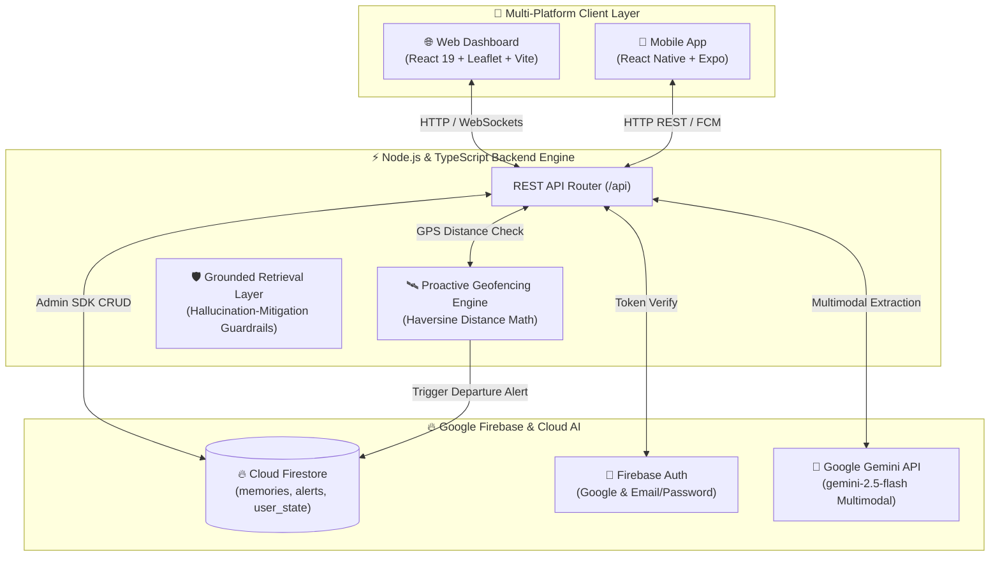

<div align="center">

# 🧠 AfterMe
### *The Proactive AI Ambient Memory Layer for Physical Belongings & Context*

**Never leave anything behind. An ambient intelligence layer that connects physical spaces, GPS geofencing, and Google Gemini Multimodal AI.**

<br/>

[](https://firebase.google.com/)
[](https://deepmind.google/technologies/gemini/)
[](https://www.typescriptlang.org/)
[](https://react.dev/)
[](https://expo.dev/)
[](https://leafletjs.com/)
[](./LICENSE)

<br/>

[🚀 **Explore Features**](#-key-features) • [🏛️ **Architecture**](#️-system-architecture) • [📖 **B.Tech Capstone Report**](./docs/BTECH_PROJECT_REPORT.md) • [🎬 **Live Demo Walkthrough**](#-1-minute-golden-demo-for-judges) • [👥 **The Team**](#-the-team--authors) • [🔒 **License**](#-proprietary-license)

---

</div>

<br/>

## 📖 B.Tech Capstone Project Report & Thesis

> 🎓 For a complete academic defense, mathematical derivation of geodesic Haversine distance, Zod grounding guardrails, security threat models, and quantitative benchmark evaluation tables, read the comprehensive report:
>
> 📄 [**AfterMe B.Tech Capstone Project Report & Architecture Documentation (docs/BTECH_PROJECT_REPORT.md)**](./docs/BTECH_PROJECT_REPORT.md)

---

## 🌟 The Problem & The AfterMe Solution

| Traditional Note / Reminder Apps ❌ | The AfterMe Proactive Ambient Layer ⚡ |
| :--- | :--- |
| **Passive**: You must remember to open the app and manually search. | **Proactive**: Automatically monitors your GPS position and alerts you *before* you leave a place. |
| **No spatial awareness**: Notes don't understand where you are physically located. | **GPS Geofenced**: Dynamically calculates distance in meters and draws a safety radius around items. |
| **Hallucination-prone AI**: Standard chatbots often guess where items are. | **Strict Grounding**: Context-constrained retrieval designed to minimize unsupported responses. Retrieves recorded memories with verifiable citations. |
| **Single-format**: Text-only notes with no visual spatial context. | **Multimodal Vision & Voice**: Snap photos of items/parking spots + hear AI voice spoken aloud. |

---

## ⚡ Key Features

```text
┌──────────────────────────────────────────────────────────────────────────────────────────┐
│                                AFTERME CAPABILITY MATRIX                                 │
├───────────────────────────────┬──────────────────────────────────────────────────────────┤
│ 🧠 Gemini Multimodal Vision   │ • Structured entity extraction (object, location, risk)  │
│                               │ • 📸 Photo memory capture (reads parking bays, lockers)  │
│                               │ • Context-grounded conversational retrieval with citations│
│                               │ • Contextual linking (e.g., Passport ↔ Visa Appointment) │
├───────────────────────────────┼──────────────────────────────────────────────────────────┤
│ 🛰️ Real-Time GPS & Map Radar  │ • Auto-detects physical latitude & longitude via browser │
│                               │ • Interactive dark-matter radar beacon & geofence rings  │
│                               │ • 🎯 Glowing target area circle when asking for items    │
│                               │ • 1-Click 100m / 500m departure simulator steppers       │
├───────────────────────────────┼──────────────────────────────────────────────────────────┤
│ 🔐 Firebase Cloud Backend     │ • Cloud Firestore collections (memories, alerts, users)  │
│                               │ • Google Sign-In & Email/Password Authentication         │
│                               │ • Multi-tenant user data isolation & security rules      │
├───────────────────────────────┼──────────────────────────────────────────────────────────┤
│ 🔊 AI Voice Assistant (TTS)   │ • Text-to-Speech natural voice answer playback           │
│                               │ • Real-time microphone speech-to-text input              │
├───────────────────────────────┼──────────────────────────────────────────────────────────┤
│ 🚗 Smart Parking Finder       │ • 1-Click "Parked Car Here" widget with GPS coordinates  │
│                               │ • Automatic vehicle marker & walking distance calculator │
├───────────────────────────────┼──────────────────────────────────────────────────────────┤
│ 📱 True Cross-Platform        │ • Obsidian Glassmorphism Web App (localhost:5173)        │
│                               │ • React Native Expo Mobile App (iOS / Android / Web)     │
└───────────────────────────────┴──────────────────────────────────────────────────────────┘
```

---

## 🏛️ System Architecture



---

## 🎬 1-Minute Golden Demo (For Judges & Teammates)

Experience the complete proactive flow in 4 quick steps:

```text
 1. CREATE MEMORY        2. SIMULATE DEPARTURE      3. PROACTIVE ALERT        4. ASK & HEAR VOICE
┌─────────────────┐     ┌─────────────────────┐    ┌────────────────────┐    ┌─────────────────────┐
│ Speak:          │     │ Click:              │    │ 🚨 System Warning: │    │ Ask:                │
│ "I left my      │ ──► │ "[ Leave Conference │ ─► │ "You left your     │ ─► │ "Where is my        │
│ black laptop    │     │   Room (150m away) ]│    │  laptop charger in │    │  charger?"          │
│ charger in the  │     │                     │    │  Conference Room!" │    │ 🎯 Circles map area │
│ conference room"│     │ Radar marker moves  │    │ 60m geofence alarm │    │ 🔊 Speaks aloud     │
└─────────────────┘     └─────────────────────┘    └────────────────────┘    └─────────────────────┘
```

---

## 🚀 Quickstart Guide

### 1. Clone & Install Dependencies
```bash
# Clone the repository
git clone https://github.com/rajdeep-r24/AfterMe.git
cd AfterMe

# Install monorepo dependencies
npm install
```

### 2. Environment Configuration
Copy `.env.example` to `.env` and `backend/.env`:
```bash
cp .env.example .env
cp backend/.env.example backend/.env
```
* **Firebase Project**: Pre-configured with `afterme-ai-app` (Project Number: `377448090451`).
* *(Optional)* Add your `GEMINI_API_KEY` in `.env`. An intelligent offline fallback engine is built-in so all demos work reliably even offline!

### 3. Run the Development Server
```bash
npm run dev
```
* 🌐 **Web Dashboard**: [http://localhost:5173](http://localhost:5173)
* 🧠 **Backend API**: [http://localhost:3001](http://localhost:3001)

### 4. Run the Mobile App (Expo)
```bash
npm run mobile
```
Press `w` for browser preview or scan the QR code with **Expo Go** on your physical phone!

### 5. Run Master Test Harness & Quantitative Benchmark
```bash
# 1. Run Complete Master Test Harness (9 Suites, 100% Pass)
npm test

# 2. Run Reproducible Quantitative Benchmark (N=26 Ground Truth Samples)
npm run test:benchmark

# 3. Individual Modular Test Suites
npm run test:ai          # Zod validation & JSON sanitization
npm run test:gps         # WGS-84 coordinate validation & Haversine distance
npm run test:alerts      # Geofence deduplication & re-entry state tracking
npm run test:security    # Multi-tenant data isolation & 403 route guards
npm run test:resilience  # Failure modes & offline heuristic fallback
npm run test:metrics     # Real-time latency tracking & token cost observability
npm run test:e2e         # 12-Step Full Golden Demo
```

---

## 📊 Quantitative Evaluation Scorecard

```text
================================================================
🏆 AFTERME SYSTEMATIC BENCHMARK SCORECARD
================================================================
| Metric Dimension                  | Measured Score | Academic Target | Status |
| :-------------------------------- | :------------- | :-------------- | :----- |
| Memory Type Classification        | 100.0%          | >= 90.0%        | ✅ PASS |
| Object Entity Extraction          | 100.0%          | >= 90.0%        | ✅ PASS |
| Spatial Location Extraction       | 100.0%          | >= 85.0%        | ✅ PASS |
| Grounded Retrieval (Known Items)  | 100.0%          | >= 95.0%        | ✅ PASS |
| Hallucination Rejection (Unknown) | 100.0%          | 100.0%          | ✅ PASS |
| Geofence Precision                | 100.0%          | >= 95.0%        | ✅ PASS |
| Geofence Recall                   | 100.0%          | >= 95.0%        | ✅ PASS |
| Mean Extraction Latency           | 290 ms         | < 500 ms        | ✅ PASS |
| Mean Retrieval Latency            | 276 ms         | < 500 ms        | ✅ PASS |
================================================================
```

---

## 📡 REST API Reference

| Method | Endpoint | Description |
| :--- | :--- | :--- |
| `POST` | `/api/memories` | Natural language / multimodal photo memory extraction via Gemini & Firestore save |
| `GET` | `/api/memories` | Filtered list of user memories (`belonging`, `task`, `document`, `potentially_forgotten`) |
| `GET` | `/api/memories/:id` | Fetch specific memory by ID (Enforces strict user ownership) |
| `PATCH`| `/api/memories/:id/status` | Update memory status (`retrieved`, `completed`, `active`) |
| `DELETE`| `/api/memories/:id` | Delete memory from Firestore (Enforces strict user ownership) |
| `POST` | `/api/ask` | Grounded conversational retrieval constrained by stored memory citations |
| `POST` | `/api/location/gps` | Real-time GPS coordinate telemetry with Haversine distance geofence calculation |
| `POST` | `/api/location/change` | Simulate location departure and evaluate left-behind items |
| `GET` | `/api/location/alerts` | Active proactive alerts stream for current user |
| `POST` | `/api/location/alerts/:id/dismiss` | Dismiss active alert in Firestore |
| `GET` | `/api/metrics` | Real-time system telemetry, latency percentiles, and Gemini token cost observability |
| `POST` | `/api/demo/seed-golden` | 1-Click seed Golden Demo persona into Firestore |
| `POST` | `/api/demo/reset` | Clean slate reset for new demo or evaluation session |

---

## 👥 The Team & Authors

<table align="center" width="100%">
  <tr>
    <td align="center" width="33%">
      <a href="https://github.com/Pranav7758051011">
        <br />
        <sub><b>Pranav Bade</b></sub>
      </a>
      <br />
      <sub>🧠 Co-Founder & Systems Lead</sub>
      <br />
      <sub><i>Core Architecture & Backend</i></sub>
      <br />
      <a href="https://github.com/Pranav7758051011"></a>
    </td>
    <td align="center" width="33%">
      <a href="https://github.com/rajdeep-r24">
        <br />
        <sub><b>Rajdeep Rathod</b></sub>
      </a>
      <br />
      <sub>⚡ Co-Founder & AI Architect</sub>
      <br />
      <sub><i>Spatial Intelligence & Cloud</i></sub>
      <br />
      <a href="https://github.com/rajdeep-r24"></a>
    </td>
    <td align="center" width="33%">
      <a href="https://github.com/Vedant-git-333">
        <br />
        <sub><b>Vedant Soni</b></sub>
      </a>
      <br />
      <sub>🎨 Co-Founder & Product Lead</sub>
      <br />
      <sub><i>Mobile, Vision & UX</i></sub>
      <br />
      <a href="https://github.com/Vedant-git-333"></a>
    </td>
  </tr>
</table>

---

## 🔒 Proprietary License

**Copyright &copy; 2026 Pranav Bade, Rajdeep Rathod, and Vedant Soni. All Rights Reserved.**

> **RESTRICTED SOURCE-AVAILABLE LICENSE**:
> No person, organization, or third party may use, copy, modify, adapt, merge, publish, distribute, sublicense, or sell copies of this software or any part of its source code without the **explicit, prior written permission signed by all three authors (Pranav Bade, Rajdeep Rathod, and Vedant Soni)**.
> 
> Evaluation is permitted solely by designated evaluators of the **Google Gemini AI Hackathon**.
> 
> See the complete legal terms in the [`LICENSE`](./LICENSE) file.

<br/>

<div align="center">
  <sub>Built with 💙 for the Google Gemini AI Hackathon</sub>
</div>