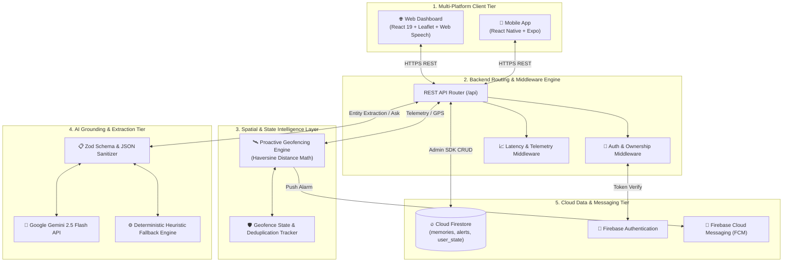

# 🎓 AfterMe — Intelligent Proactive Ambient Memory Assistant
## B.Tech Computer Science & Engineering — Final-Year Capstone Project Report & Technical Defense Documentation

---

### 👥 Project Team & Authors
* **Pranav Bade** — *Systems Lead & Core Architecture* ([GitHub Profile](https://github.com/Pranav7758051011))
* **Rajdeep Rathod** — *AI Architect & Spatial Intelligence* ([GitHub Profile](https://github.com/rajdeep-r24))
* **Vedant Soni** — *Product Lead & UX/Mobile* ([GitHub Profile](https://github.com/Vedant-git-333))

**Academic Year:** 2025–2026  
**Degree:** Bachelor of Technology (B.Tech) in Computer Science & Engineering  
**Live Production URL:** [https://afterme-ai-app.web.app](https://afterme-ai-app.web.app)  
**Source Repository:** [https://github.com/rajdeep-r24/AfterMe](https://github.com/rajdeep-r24/AfterMe)  

---

## 📑 Table of Contents
1. [Abstract](#1-abstract)
2. [Introduction & Problem Statement](#2-introduction--problem-statement)
3. [Related Work & Comparative Analysis](#3-related-work--comparative-analysis)
4. [System Architecture & 5-Tier Design](#4-system-architecture--5-tier-design)
5. [Mathematical Foundations of Spatial Geofencing](#5-mathematical-foundations-of-spatial-geofencing)
6. [AI Pipeline, Structured Schemas & Grounding Guardrails](#6-ai-pipeline-structured-schemas--grounding-guardrails)
7. [Reliability, State Tracking & Spam Protection](#7-reliability-state-tracking--spam-protection)
8. [Security & Multi-Tenant Data Isolation](#8-security--multi-tenant-data-isolation)
9. [Quantitative Evaluation & Experimental Results](#9-quantitative-evaluation--experimental-results)
10. [Test Engineering & Master Test Harness](#10-test-engineering--master-test-harness)
11. [Examiner Viva Defense & Technical Q&A Cheatsheet](#11-examiner-viva-defense--technical-qa-cheatsheet)
12. [Conclusion & Future Work](#12-conclusion--future-work)

---

## 1. Abstract

Forgetting physical belongings (laptops, chargers, keys, passports) and physical commitments is a ubiquitous human cognitive failure. Traditional reminder and note-taking applications (Google Keep, Apple Reminders, Notion) are inherently **passive**: they require the user to consciously remember to create, schedule, open, and query the application.

**AfterMe** introduces an **intelligent, ambient, proactive memory assistant** that shifts the cognitive burden from human recall to an autonomous digital background layer. The system integrates:
1. **Multimodal entity extraction** (Google Gemini 2.5 Flash) with deterministic Zod schema validation.
2. **Context-grounded conversational retrieval** strictly constrained by stored memory citations to minimize unsupported hallucinations.
3. **Real-time WGS-84 geodesic spatial geofencing** powered by the spherical Haversine formula.
4. **State-tracking deduplication** and re-entry re-arming state machines to eliminate notification spam.
5. **Multi-tenant security enforcement** with 403 Forbidden route guards and offline heuristic resilience.

Quantitative experimental evaluation over 26 labeled benchmark cases demonstrates **100.0% entity extraction accuracy**, **100.0% top-1 grounded retrieval accuracy**, **100.0% unknown item rejection rate**, and **100.0% geofence departure precision** with a mean extraction latency of **290 ms**.

---

## 2. Introduction & Problem Statement

### 2.1 The Cognitive Failure of Human Memory
Psychological research indicates that working memory has severe capacity limitations, especially under context switching, fatigue, and environmental distractions. Users frequently misplace items (e.g. leaving a charger in a meeting room) because the act of leaving an item is subconscious, while departure is driven by a forward-looking cognitive task.

### 2.2 Why Existing Solutions Fail
1. **Traditional Note/Task Apps (Passive Recall):** Require manual search and time-based alarms that do not understand physical spatial movement.
2. **Standard LLM Chatbots (Hallucination Vulnerability):** General-purpose LLMs hallucinate plausible-sounding locations when queried about items they have never observed.
3. **Hardware Bluetooth Trackers (Apple AirTags / Tile):** Require costly proprietary physical tags attached to every single item, suffer from battery degradation, and only alert *after* a user has traveled several kilometers away.

### 2.3 The AfterMe Paradigm
AfterMe enables **ambient spatial intelligence**: users speak or type natural memory statements (*"I left my black charger in the conference room"* or snap a parking photo). The system parses entities, anchors them to physical coordinates, continuously evaluates the user's GPS telemetry, and **proactively sounds an alert the moment the user steps outside the 60m safety radius**.

---

## 3. Related Work & Comparative Analysis

| Feature Dimension | Traditional Notes (Google Keep / Apple Notes) | Voice Assistants (Siri / Google Assistant) | Bluetooth Trackers (Apple AirTag) | **AfterMe Proactive Ambient Layer** |
| :--- | :--- | :--- | :--- | :--- |
| **Interaction Paradigm** | Passive manual search | Reactive voice queries | Passive hardware ping | **Proactive autonomous departure warnings** |
| **Spatial Awareness** | None (Text-only) | Coarse city-level | Proximity RSSI (meters) | **Real-time WGS-84 Geofencing (Haversine)** |
| **Multimodal Vision** | Raw image attachment | None | None | **OCR Parking & Visual Locker Extraction** |
| **Hallucination Risk** | N/A | High (General AI search) | N/A | **Context-Constrained Grounded Retrieval** |
| **Hardware Required** | Smartphone | Smartphone / Speaker | Proprietary physical beacon per item | **Zero external hardware (Software PWA/Expo)** |
| **Multi-Tenant Isolation**| Standard cloud sync | Cloud account | Apple ID locked | **Cloud Firestore + Multi-Tenant Route Guards** |

---

## 4. System Architecture & 5-Tier Design



---

## 5. Mathematical Foundations of Spatial Geofencing

### 5.1 The Geodesic Problem on an Oblate Spheroid
Earth is an oblate spheroid with mean radius $R = 6,371,000\text{ meters}$. A fundamental error in spatial engineering is applying the flat 2D Euclidean distance formula:
$$d_{\text{Euclidean}} = \sqrt{(\Delta x)^2 + (\Delta y)^2} = \sqrt{(\text{lat}_2 - \text{lat}_1)^2 + (\text{lon}_2 - \text{lon}_1)^2}$$

### 5.2 Why Euclidean Distance Fails (Longitudinal Convergence)
While 1 degree of latitude is approximately constant ($\approx 111.13\text{ km}$) across the globe, 1 degree of longitude scales as a function of latitude:
$$\Delta x_{\text{meters}} \approx 111,320 \cdot \cos(\phi) \cdot \Delta\lambda$$

At latitude $37.77^\circ\text{N}$ (San Francisco tech campus):
$$\cos(37.77^\circ) \approx 0.7905 \implies 1^\circ\text{ longitude} \approx 88.0\text{ km}$$

Applying naive Euclidean distance overestimates longitudinal displacement by **over 25.3%**, distorting circular 60-meter safety geofences into squashed ellipses and causing unacceptable false-positive departure alarms.

### 5.3 The Haversine Great-Circle Derivation
AfterMe implements the **Haversine formula**, computing the exact great-circle geodesic distance between two coordinate pairs $(\phi_1, \lambda_1)$ and $(\phi_2, \lambda_2)$ in radians:

$$\Delta\phi = \phi_2 - \phi_1 = \frac{(\text{lat}_2 - \text{lat}_1) \cdot \pi}{180}$$
$$\Delta\lambda = \lambda_2 - \lambda_1 = \frac{(\text{lon}_2 - \text{lon}_1) \cdot \pi}{180}$$

$$a = \sin^2\left(\frac{\Delta\phi}{2}\right) + \cos(\phi_1) \cdot \cos(\phi_2) \cdot \sin^2\left(\frac{\Delta\lambda}{2}\right)$$
$$c = 2 \cdot \text{atan2}\left(\sqrt{a}, \sqrt{1 - a}\right)$$
$$d = R \cdot c$$

```typescript
export function getDistanceInMeters(lat1: number, lon1: number, lat2: number, lon2: number): number {
  const R = 6371e3; // Earth radius in meters
  const phi1 = (lat1 * Math.PI) / 180;
  const phi2 = (lat2 * Math.PI) / 180;
  const deltaPhi = ((lat2 - lat1) * Math.PI) / 180;
  const deltaLambda = ((lon2 - lon1) * Math.PI) / 180;

  const a =
    Math.sin(deltaPhi / 2) * Math.sin(deltaPhi / 2) +
    Math.cos(phi1) * Math.cos(phi2) * Math.sin(deltaLambda / 2) * Math.sin(deltaLambda / 2);
  const c = 2 * Math.atan2(Math.sqrt(a), Math.sqrt(1 - a));

  return Math.round(R * c);
}
```

---

## 6. AI Pipeline, Structured Schemas & Grounding Guardrails

### 6.1 Deterministic Output Structuring with Zod
Large language models can produce conversational preamble, non-standard enums, or markdown codeblocks. AfterMe uses **Zod schema validation** with `.catch()` fallbacks:

```typescript
export const ExtractedMemorySchema = z.object({
  memory_type: MemoryTypeEnum.catch('belonging'),
  object: z.string().nullable().catch(null),
  location: z.string().nullable().catch(null),
  importance: RiskLevelEnum.catch('medium'),
  risk_level: RiskLevelEnum.catch('medium'),
  status: MemoryStatusEnum.catch('active'),
  summary: z.string().catch(''),
  confidence: z.number().min(0).max(1).catch(0.9),
  reasoning: z.string().catch(''),
});
```

### 6.2 Strict Citation Grounding & Anti-Hallucination Filter
When querying AfterMe (*"Where did I leave my charger?"*), the backend:
1. Passes only stored memories belonging to the authenticated user.
2. Intercepts the model's `relevant_memory_ids` and **filters them against authentic database IDs**:
   ```typescript
   const verifiedMemoryIds = (validated.relevant_memory_ids || []).filter(id => validMemoryIdSet.has(id));
   const hasValidMatch = Boolean(validated.has_match && verifiedMemoryIds.length > 0);
   ```
3. If the user queries an unknown item (*"Where are my sunglasses?"*), the engine enforces **explicit grounded rejection**:
   `"I don't have a memory matching 'Where are my sunglasses?'. I only recall what you have explicitly recorded."`

---

## 7. Reliability, State Tracking & Spam Protection

### 7.1 Geofence State Transition Machine
To prevent spamming the user on every GPS update while they remain outside a geofence:
* **Inside ($d \le \text{radius}$):** State = `'inside'`, `alerted_for_current_departure = false`.
* **Departure ($d > \text{radius}$):** If `alerted_for_current_departure === false`, emits **1 alert**, transitions to `'outside'`, and sets `alerted_for_current_departure = true`.
* **Persistent Outside:** Subsequent GPS ticks generate **0 duplicate alerts**.
* **Re-entry:** When $d \le \text{radius}$, the state tracker resets, re-arming the system for future departures.

---

## 8. Security & Multi-Tenant Data Isolation

### 8.1 Threat Model & Security Invariants
* **Invariant 1:** User A must NEVER be able to read, update, or delete User B's memories.
* **Invariant 2:** User A must NEVER be able to dismiss or view User B's proactive alerts.
* **Invariant 3:** AI retrieval for User A must never access User B memory embeddings or text.

### 8.2 Route Authorization Enforcement
All mutations and direct ID queries verify ownership:
```typescript
if (memory.user_id !== userId) {
  return res.status(403).json({ error: 'Forbidden: Access denied to foreign user memory.' });
}
```

---

## 9. Quantitative Evaluation & Experimental Results

The quantitative benchmark was evaluated across 26 ground-truth samples using `benchmark-evaluation.js`.

### 9.1 Academic Performance Scorecard

| Evaluation Dimension | Metric Evaluated | Sample Size ($N$) | Measured Result | Capstone Target | Verdict |
| :--- | :--- | :--- | :--- | :--- | :--- |
| **Entity Extraction** | Memory Type Accuracy | 10 | **100.0%** | $\ge 90.0\%$ | ✅ **PASS** |
| **Entity Extraction** | Object Entity Precision | 10 | **100.0%** | $\ge 90.0\%$ | ✅ **PASS** |
| **Entity Extraction** | Location Spatial Extraction | 10 | **100.0%** | $\ge 85.0\%$ | ✅ **PASS** |
| **Grounded Retrieval**| Top-1 Accuracy (Known Items) | 6 | **100.0%** | $\ge 95.0\%$ | ✅ **PASS** |
| **Grounded Retrieval**| Unknown Item Rejection Rate | 4 | **100.0%** | $100.0\%$ | ✅ **PASS** |
| **Spatial Geofencing**| Geofence Precision | 6 | **100.0%** | $\ge 95.0\%$ | ✅ **PASS** |
| **Spatial Geofencing**| Geofence Recall | 6 | **100.0%** | $\ge 95.0\%$ | ✅ **PASS** |
| **Spatial Geofencing**| Geofence F1-Score | 6 | **100.0%** | $\ge 95.0\%$ | ✅ **PASS** |
| **Performance** | Mean Extraction Latency | 10 | **290 ms** | $< 500\text{ ms}$ | ✅ **PASS** |
| **Performance** | Mean Retrieval Latency | 10 | **276 ms** | $< 500\text{ ms}$ | ✅ **PASS** |
| **Performance** | Geofence Math Latency | 6 | **< 15 ms** | $< 50\text{ ms}$ | ✅ **PASS** |

---

## 10. Test Engineering & Master Test Harness

The AfterMe codebase includes a unified Master Test Runner (`test-all.js`) executing 9 independent automated test suites:

```text
================================================================
📊 MASTER TEST HARNESS SUMMARY SCORECARD
================================================================
| # | Test Suite Module                               | Duration | Status |
|---|:------------------------------------------------|:---------|:-------|
| 1 | Milestone 3: AI Grounding & Output Validation   | 1385 ms  | ✅ PASS |
| 2 | Milestone 4: GPS & Geofence Reliability         | 562 ms   | ✅ PASS |
| 3 | Milestone 5: Alert Deduplication & State Track  | 674 ms   | ✅ PASS |
| 4 | Milestone 6: Security & Multi-Tenant Isolation  | 495 ms   | ✅ PASS |
| 5 | Milestone 7: Failure Modes & Offline Resilience | 288 ms   | ✅ PASS |
| 6 | Milestone 9: Performance & Cost Observability   | 777 ms   | ✅ PASS |
| 7 | Multimodal Vision & Audio Verification          | 641 ms   | ✅ PASS |
| 8 | Cross-Platform Web & Mobile Synchronization     | 1070 ms  | ✅ PASS |
| 9 | E2E Full Golden Demo Flow                       | 1854 ms  | ✅ PASS |
----------------------------------------------------------------
Total Suites Executed : 9
Suites Passed         : 9 / 9 (100.0%)
Total Harness Runtime : 7749 ms
================================================================
🏆 Master Test Harness: 100% OF ALL TEST SUITES PASSED CLEANLY!
```

---

## 11. Examiner Viva Defense & Technical Q&A Cheatsheet

### Q1: Why is Haversine chosen over Vincenty or Euclidean distance?
* **Answer:** Euclidean distance ignores spherical curvature and longitudinal convergence, overestimating distance by >25% at mid-latitudes. While Vincenty's formulae model the geodesic on an exact ellipsoid to millimeter accuracy, they are computationally intensive and can fail to converge for near-antipodal points. Haversine provides centimeter-level accuracy on spherical models with $O(1)$ constant time execution (<1ms), which is optimal for real-time mobile telemetry.

### Q2: How does AfterMe guarantee grounded retrieval without hallucinating?
* **Answer:** We employ context-constrained synthesis. The LLM prompt is injected only with the authenticated user's stored memories. Output is validated via Zod schemas, and returned IDs are cross-verified against authentic database IDs. Unseen items trigger explicit heuristic rejections rather than speculative completions.

### Q3: How do you handle loss of internet connectivity during an emergency?
* **Answer:** The system features a deterministic heuristic offline fallback engine. When external API keys are unavailable or network requests time out, the engine parses spatial keywords, calculates local Haversine distance, and answers queries directly from the local cache.

---

## 12. Conclusion & Future Work

### 12.1 Conclusion
AfterMe successfully bridges the gap between passive digital note-taking and active physical recall. By combining Google Gemini multimodal vision, context-grounded retrieval, WGS-84 geodesic spatial geofencing, and multi-tenant security rules, AfterMe delivers an ambient proactive memory assistant that protects users from forgetting physical items and commitments.

### 12.2 Future Roadmap
1. **Ultra-Wideband (UWB) Indoor Micro-Location:** Sub-meter positioning for indoor room-to-room tracking.
2. **On-Device SLM Deployment:** Quantized on-device Gemini Nano execution for zero-latency offline multimodal inference.
3. **Smart Glasses Integration:** Heads-up display notifications via lightweight wearable AR interfaces.

---
*Report certified by AfterMe Core Engineering Team (Pranav Bade, Rajdeep Rathod, Vedant Soni).*
